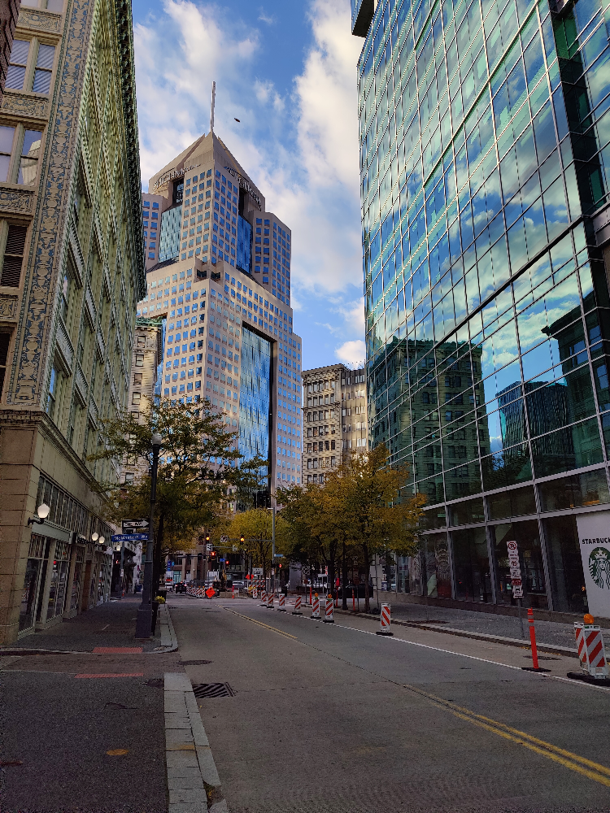

# gradientshop

This is a partial implementation of GradiantShop https://grail.cs.washington.edu/projects/gradientshop/demos/gs_paper_TOG_2009.pdf. This implementation is intended to be a lightweight alternative in Python.

Image are assumed to be non-linear sRGB. The following filters are implemented:
1. Non-photorealistic rendering (default): Blurs out detail while preserving edges to achieve artistic effect.
2. Saliency sharpening: Sharpens edges.
3. Sparse interpolation: Takes in guide image and user image with user scribbles applied to guide image.
   Creates a new image with colors from user scribbles and gradients from luminance of guide image.

Constants: Constants include c1, b, c2, sigma, and can be modified. In particular, the sigma constant is worth playing around to control the strength of the NPR filter.

Deviations: The most important difference between this implementation and GradientShop is that this
implementation uses a Sobel edge detector instead of one based on second order Gaussian steerable filters.
Another difference is that length estimation via message passing is optional. Good images have been
achieved with none or a lower number of passes. Additionally, sigma is calculated depending on the number of passes.
Finally, for sparse interpolation the target gradients are those of luminance of the guide image. (TODO: Improve sparse interpolation)

Original             |  Processed
:-------------------------:|:-------------------------:
 | 
 | 
 | 
 | 
 | 

